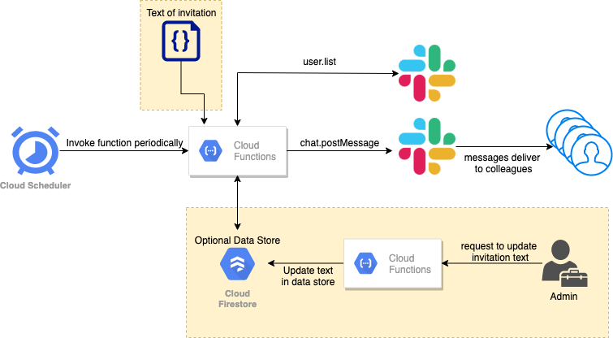

# Shout out prompter

## Requirements

ShoutOut prompter    
Lets say that there are X employees at DigIO. We would like to invite (prompt) every employee to give a shoutout to at
least one colleague every month. We would like to generate a prompt, via a bot in Slack, to a random y% of employees
every week, inviting them to recognise a great deed, a winning attitude, a probing question, an astounding invention, a
witty remark, a time-saving automation - something shout-out-able about one of their colleagues.  
Over the course of the month, X employees should have received an invitation to do this. We might want to change up the
text of the invitation regularly, so as to remove the fatigue element. The invitation should go directly to the
recipient from Slack-bot, or perhaps Slack-bot masquerading as Pat

## Design

This slackbot can be a serverless function deployed on any cloud platform. For the bots I built, I hosted them on GCP,
so I will use that as an example.  
Cloud function has a [free tier](https://cloud.google.com/functions/pricing) of 2 million calls per month, which is
plenty for our use case.  
We can use cloud scheduler to invoke this function periodically, for example, every Friday. Cloud scheduler has
a [free tier](https://cloud.google.com/scheduler/pricing) of 3 jobs per month. For our use-case, we only need one.  
To save the cost of this slackbot, ideally, we want to avoid using any persist store. That means the function we design
needs to be stateless. If that's too hard to achieve, we can use cheap document-based storage (NoSQL) like Firestore. It
also has a [free tier](https://cloud.google.com/firestore/quotas#Instances) of 1GB of storage, 50000 reads/day, 20000
writes/day and 10Gb network egress/month, which should be plenty for this use case.

### High level design

*Note: the free quotas mentioned above are applied to per billing account. For MantelGroup, we might already have other
projects that use free quotas. Therefore, running this slackbot might bear a small cost (at most a cup of coffee per
month)*

## Function

The serverless function is the core component that delivers messages to our colleagues. It needs to execute the
following steps:

1. Fetch the full list of users in MantelGroup slack
2. Pick up y% of the users randomly from the list
3. Send the preconfigured message to those picked users

Sounds pretty simple, right? Let's dive into the details.

### Slack API: Authentication

To be able to talk to Slack API, the bot will need to obtain a bot token. This token is generated when we create the
slack bot. During that process we also need to define the scopes of that token. For more details, please follow this
[guide](https://api.slack.com/authentication/basics#installing).  
*More about scopes later*

### Slack API: Get Users

We can use `users.list` method to fetch slack users. The scope required is `users.read`.  
[API doc](https://api.slack.com/methods/users.list)  
Here, we need to make sure that we only fetch active human users. You might find flags like `is_bot`, `is_app_user`
useful. Also, if we need to only deliver messages to DigIO colleagues, you can make use of `team_id` field.  
The information we need to keep is the unique user ID.  
*Note: this user list is ever-changing. We have people join us and leave us.*

### Random Selector

The job of random selector is to pick y% of people every period of time out of the user list we get above.  
The goal is to pick 100% of the people every n cycle. Let's assume we want to reach every one in 4 weeks, this selector
needs to pick 25% of people each time and cover everybody after 4 cycles.  
If we can achieve this without persist states (like I have sent message in this cycle to A, B and C), that will be
amazing. If not, we can use a document based database to track the information we need.

### Slack API: Post Message

Once we have selected users, we can use `chat.postMessage` method to send a message to those users. The scope required
is `chat:write`.  
[API doc](https://api.slack.com/methods/chat.postMessage)  
This part can be reused.

### Text of the Invitation

Text of the invitation can be hardcoded in the code. However, it is not going to be easy to change.  
To make the changing process easier, we can consider the following ways:

#### File approach

Save the text in a file. The function reads invitation text from this file.  
To update the text, anyone with read access to the source code repo can clone it and update the text in the file.  
Once that's done, we can use a script to package the function with the updated file and deploy it 
(see deployment section).

#### Persist store approach

Save the text in the document-based database. The function reads text from the database. To update the text,
any authorised people can send a HTTP request to a cloud function with desired text payload. This new cloud function is
responsible for replacing the text stored in database.

## Deployment

### Cloud scheduler

This can be set up manually, and we only need to do it once. So it's not going to be a big problem to do it manually.

### Firestore (optional)

If we decide to use persist store, we can create firestore manually. It's going to be an once-off job, too.

### Cloud Functions

The gist of cloud function deployment is very simple. We need to zip all the source code and upload it to a designated 
location (cloud bucket).  
There is a handy tool we can use to simplify this process, you can read more about it
[here](https://www.serverless.com/framework/docs/providers/google/).